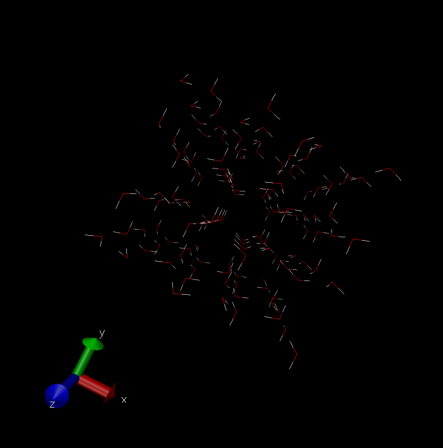

# LAMMPS Simulation for Water using SPC/E Forcefield
In this tutorial we learn how to run an MD simulation for water and ice Ih.

## Install GenIce2
```
pip3 install genice2
```

## Install VMD
```
https://www.ks.uiuc.edu/Research/vmd/
```

## Generate ice Ih configuration using GenIce2
```
genice2 1h -w physical_water --rep 2 2 2 --format gromacs > ice1h128.gro
```

## Generate LAMMPS data file with VMD
Download the `.gro` file with `scp`:
```
realpath ice1h128.gro
scp <YourNetID>@adroit-vis.princeton.edu:PATH_TO_GRO .
```

Load the `.gro` file in VMD:
