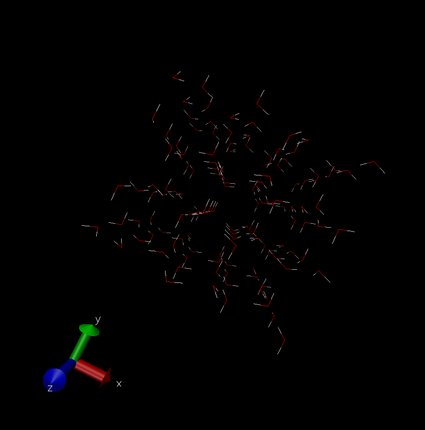
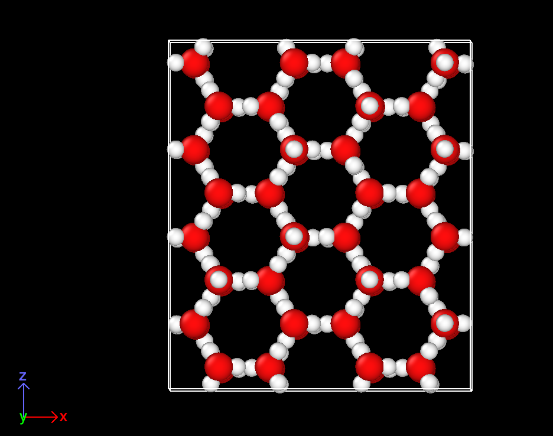
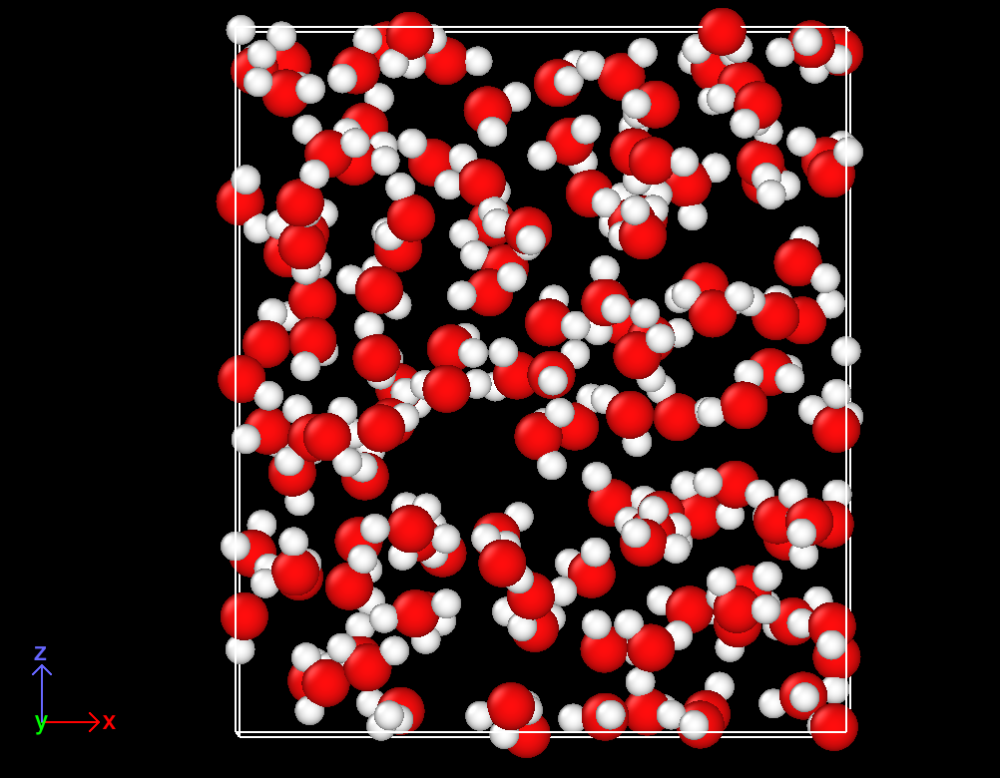
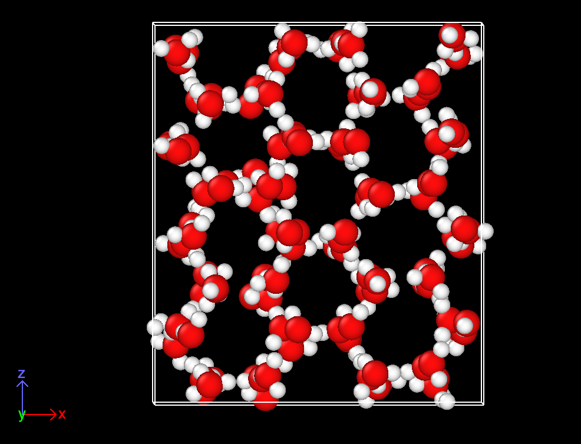

# LAMMPS Simulation for Water using SPC/E Forcefield
In this tutorial we learn how to run an MD simulation for water and ice Ih.

## Install GenIce2
```
pip3 install genice2
```

## Install VMD
```
https://www.ks.uiuc.edu/Research/vmd/
```

## Generate ice Ih configuration using GenIce2
```
genice2 1h -w physical_water --rep 2 2 2 --format gromacs > ice1h128.gro
```

## Generate LAMMPS data file with VMD
Download the `.gro` file with `scp`:
```
realpath ice1h128.gro
scp <YourNetID>@adroit-vis.princeton.edu:PATH_TO_GRO .
```

Load the `.gro` file in VMD:


Let's take a look at `topo.tcl` by running `cat topo.tcl`:
```
set nH2O 128
set lO {}
set lH1 {}
set lH2 {}
for {set x 0} {$x <$nH2O} {incr x} {lappend lO [ expr 3*$x+0]}
for {set x 0} {$x <$nH2O} {incr x} {lappend lH1 [ expr 3*$x+1]}
for {set x 0} {$x <$nH2O} {incr x} {lappend lH2 [ expr 3*$x+2]}
puts $lO
puts $lH1
puts $lH2
set selO [atomselect top "index $lO"]
set selH1 [atomselect top "index $lH1"]
set selH2 [atomselect top "index $lH2"]
for {set x 0} {$x <$nH2O} {incr x} {
set id0 [lindex $lO $x];
set id1 [lindex $lH1 $x];
set id2 [lindex $lH2 $x];
topo addbond $id0 $id1;
topo addbond $id0 $id2;
topo addangle $id1 $id0 $id2;
}
$selO set charge -0.8476
$selH1 set charge 0.4238
$selH2 set charge 0.4238
topo writelammpsdata water.data
```

We may directly generate the data file in VMD's Tk Console by using
```
source topo.tcl
```

Upload the data file onto the cluster:
```
scp water.data <YourNetID>@adroit-vis.princeton.edu:PATH_TO_WATER_TUTORIAL
```

## Run the simulation
The initial configuration of our simulation is ice Ih.

At 300 K, you will observe ice Ih melting. 

Ice will remain to be ice at 100 K.



Now let's enter the working directory:
```
cd 300K
```

If you run MD using slurm, run the following command:
```
sbatch run.slurm
```
If not, just run LAMMPS:
```
lmp -in spec.lmp
```

Things are similar for 100 K.